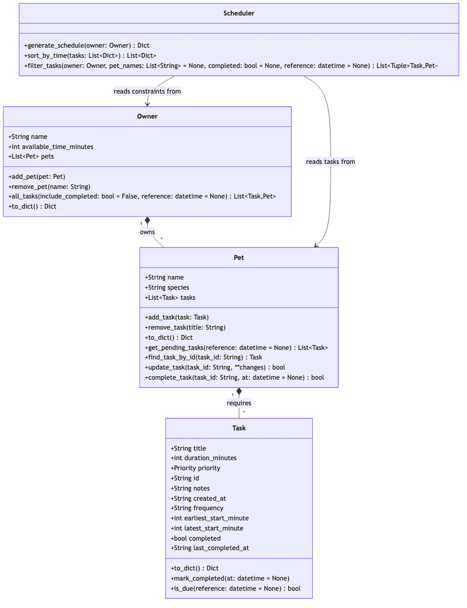

# PawPal+ (Module 2 Project)

You are building **PawPal+**, a Streamlit app that helps a pet owner plan care tasks for their pet.

## Scenario

A busy pet owner needs help staying consistent with pet care. They want an assistant that can:

- Track pet care tasks (walks, feeding, meds, enrichment, grooming, etc.)
- Consider constraints (time available, priority, owner preferences)
- Produce a daily plan and explain why it chose that plan

Your job is to design the system first (UML), then implement the logic in Python, then connect it to the Streamlit UI.

## What you will build

Your final app should:

- Let a user enter basic owner + pet info
- Let a user add/edit tasks (duration + priority at minimum)
- Generate a daily schedule/plan based on constraints and priorities
- Display the plan clearly (and ideally explain the reasoning)
- Include tests for the most important scheduling behaviors

## Getting started

### Setup

```bash
python -m venv .venv
source .venv/bin/activate  # Windows: .venv\Scripts\activate
pip install -r requirements.txt
```

### Suggested workflow

1. Read the scenario carefully and identify requirements and edge cases.
2. Draft a UML diagram (classes, attributes, methods, relationships).
3. Convert UML into Python class stubs (no logic yet).
4. Implement scheduling logic in small increments.
5. Add tests to verify key behaviors.
6. Connect your logic to the Streamlit UI in `app.py`.
7. Refine UML so it matches what you actually built.

## 🖥️ Demo Walkthrough

Use the terminal demo and the Streamlit app together to validate the PawPal+ workflow.

### Main UI features

- `Owner` profile input with available time budget.
- Add pet profiles with a name and species.
- Create care tasks for pets with duration and priority.
- Generate a daily schedule in one click.
- View accepted tasks, rejected tasks, and conflict warnings inline.

### Example workflow

1. Enter owner details and available time.
2. Add a pet profile such as `Mochi` or `Rex`.
3. Add one or more tasks for the pet, including task name, duration, and priority.
4. Click **Generate schedule**.
5. Review the accepted schedule, rejected tasks, and any warnings about conflicting fixed-time tasks.

### Key scheduler behaviors shown

- Sorting by priority and time windows (`Scheduler.generate_schedule()`).
- Ordering accepted tasks by `start_minute` via `Scheduler.sort_by_time()`.
- Filtering tasks by due-ness and completion state (`Owner.all_tasks()` and `Scheduler.filter_tasks()`).
- Conflict warnings for fixed-start overlapping tasks.
- Recurring task support for daily/weekly tasks and completion-driven reactivation.

### Sample CLI output

```bash
Today's Schedule
------------------
1. Feed (Mochi) — 5m — high
2. Morning walk (Rex) — 30m — high
3. Morning play (Mochi) — 20m — medium

Rejected tasks (didn't fit):
- Grooming (Rex) — 45m

Reasoning:
Owner 'Alex' available time: 90 minutes
Total scheduled time: 55 minutes
Tasks considered: 4
Tasks accepted: 3
Tasks rejected: 1
```

## Features

The app implements the following core capabilities from `pawpal_system.py`, surfaced in `app.py` and validated by `main.py`:

- **Sorting by time and priority** — tasks are prioritized by `high`, `medium`, and `low`, then by earliest allowable start time and duration.
- **Conflict warnings** — the scheduler detects fixed-window overlaps and warns the user if two tasks require the same exact start time.
- **Recurring tasks** — `Task.is_due()` and `Pet.complete_task()` support daily and weekly recurrence.
- **Task filtering** — the system filters due tasks and can optionally filter by pet or completion state.
- **Schedule generation** — greedy slotting within the owner's available time approves tasks that fit and rejects the rest with reasoning.

## 🧪 Testing PawPal+

Run the automated test suite to verify the core scheduling system.

```bash
python -m pytest
```

The current tests cover:

- `Task.is_due()` recurrence and due-ness logic
- `Pet.complete_task()` recurring task completion and clone behavior
- `Scheduler.generate_schedule()` schedule generation, ordering, and filtering
- `Scheduler.sort_by_time()` acceptance ordering and `Scheduler.filter_tasks()` task filtering by pet/completion

Sample successful test output:

```bash
============================= test session starts ==============================
platform darwin -- Python 3.14.5, pytest-9.1.1, pluggy-1.6.0
rootdir: /Users/kevinshan/Desktop/CodePath/Github/ai110-module2show-pawpal-starter
plugins: anyio-4.13.0
collected 2 items                                                               

tests/test_pawpal.py ..                                                  [100%]

============================== 2 passed in 0.01s ==============================
```

Confidence Level: ★★★☆☆

This reflects the current correctness of the covered behaviors while acknowledging that the scheduler is still a simple greedy implementation and could be extended with richer overlap/conflict handling.

## Architecture and Files

Key implementation files:

- `pawpal_system.py` — core domain model and scheduling logic.
- `app.py` — Streamlit UI wiring and schedule display.
- `main.py` — terminal demo harness for generating sample schedules.
- `tests/test_pawpal.py` — automated unit tests.
- `diagrams/uml_final.mmd` — final Mermaid UML source.

## System Architecture



